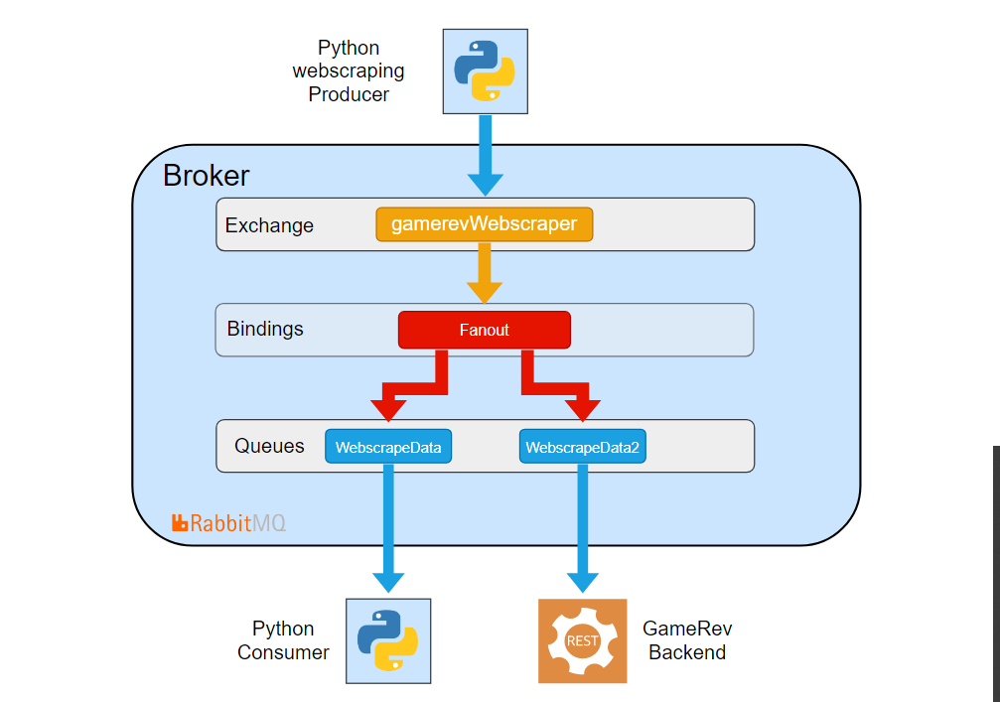

# Team 5 - #IkkeForLangt

- Andreas Guldborg Heick - cph-ah384@cphbusiness.dk
- Rasmus Jarnborg Friis - cph-rf43@cphbusiness.dk
- Mohammad Hariri - cph-mh682@cphbusiness.dk

<br>

# gameRev

gameRev is a game review platform, where people from all around the world can read and write reviews for their favorite games.

<br>

## Mini Project 2: Message-Oriented Middleware

We have created a MOM application, that is supposed to supplement our gameRev project, by adding more info webscraped from steamspy.com.
The API we used for gameRev, doesn't contain prices and number of game owners, an information we would like to possess and maybe use later.

So we have built a webscraper in python, that webscrapes price and number of owners, for the games we have on gameRev. We chose python because it is super easy to webscrape in,
and also so we can demonstrate the use of RabbitMQ. We want to be able to exchange json data between our webscraper and our java project, and RabbitMQ can do this for us.
After webscraping, our application dumps the data as json, and publishes it to RabbitMQ, so other application in different languages can listen and use the data.
For demonstration we have written a separate python receiver, that can listen to RabbitMQ and read the data. This example demonstrates MOM.

#### Diagram over our Message Broker architecture


### Installation - what you need
 * RabbitMQ - you need this open and ready, we used it locally using a Docker file. 
 
 Here is a docker image that you can use
 ```
 docker run --rm -d  -p 15671:15671/tcp -p 15672:15672/tcp -p 15691:15691/tcp -p 15692:15692/tcp -p 25672:25672/tcp -p 4369:4369/tcp -p 5671:5671/tcp -p 5672:5672/tcp rabbitmq:3-management
 ```
 
 * Python/Jupyter Notebook - for the notebooks
 
 ## Setup 
 1. Open and run your RabbitMQ
 2. Run MOM GameRev - Mini Project 2.ipynb - this is the webscraper and publishes the data to RabbitMQ 
 3. Run MOM GameRev - Mini Project 2 Receiver.ipynb - this consumes the data
