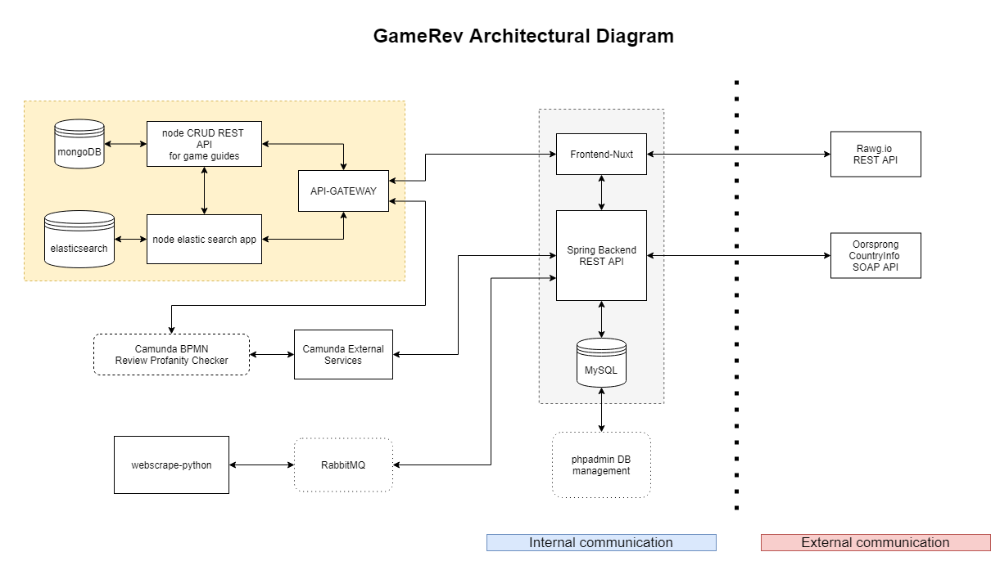

# Team 5 -  #IkkeForLangt

- Andreas Guldborg Heick - cph-ah384@cphbusiness.dk
- Rasmus Jarnborg Friis - cph-rf43@cphbusiness.dk
- Mohammad Hariri - cph-mh682@cphbusiness.dk

<br>

# gameRev

gameRev is a game review platform, where people from all around the world can read and write reviews for their favorite games. New features include game guides and game prices.



This architecural diagram shows our architecture, and how our different applications communicate. We have a monolithic application, that includes our frontend, backend and our database, this is the base application. We also have a BPMN service that takes reviews before they are saved, and checks them in a profanity filter, before sending them to the backend.
Then we have a microservice setup, that combines the two microservices nodeCRUD and nodeElasticSearch, by taking game guides from the nodeCRUD service and using them in the nodeElasticSearch, and then serving them via the API Gateway. The last application we have is the webscraping service, that webscrapes game prices and number of units sold, and via the RabbitMQ broker, sends this data out to our REST backend.

<br>

## Implementation & features

### Frontend

We have developed a client frontend using Vue.js combined with the Nuxt.js framework. The frontend uses Vue, Nuxt, HTML and CSS with bootstrap, to create a frontpage, that serves the client with several popular games.

A client can then click on a game, and see more details, including other people's reviews. The client can also write their own reviews, and give a rating between 1-5 stars.

Our frontend's only function is to display data served by our backend and our microservices/components, but we have also used our frontend to fetch from the rawg.io API.
The API from rawg.io, only provides us with game data and nothing else.

Some newer features that have been added to gameRev's platform, include a game guide and a game price section. The game guides offers access to a section where users can search for game guides and read them. The game price section displays a list of games, including info like the current steam price, and the number of units sold. The game price data is fetched every 10 minutes, to keep the users updated on the latest prices and information.

<br>

### Backend

For the System Integration part, we have used a Java backend using Spring Boot. Spring Boot makes it easy to create stand-alone, production-grade Spring based Applications that you can "just run".

The backend is a REST API, that sends JSON as response.
Using Axios in the frontend, we can call on the backend, and use CRUD operations on the database, which is built in MySQL.

Our backend also communicates with a SOAP API that takes a country ISOCODE and returns that country's flag. We use this for our reviews, so reviewers and people reading reviews, can show and see which country the reviewer comes from.

So we have a backend that consumes SOAP requests and itself communicates using REST with other services. One exception is AMQP that the backend communicates with RabbitMQ in.

<br>

### SpringBoot Setup

Our Java backend uses PHPAdmin to communicate with the MySQL database, this tool can be used to view the database.

<br>

### Camunda

We are using Camunda to check for profanities in our reviews before they have been comitted to the database. In case they contain profanities camunda
will catch them and wait for an approval from an admin.

[Further BPMN Documentation](https://github.com/Hoppedyr/gameRev/tree/main/GameRev-Camunda)

<br>

### Webscraping - RabbitMQ

We have used a python script to webscrape from SteamSpy, and retrieve game prices and how many units that the game has sold. We used RabbitMQ as the broker that takes care of the communication between our backend and our webscraper script using the AMQP protocol.

[Further Webscraping Documentation](https://github.com/Hoppedyr/gameRev/tree/main/GameRev-Webscraping)

<br>

### Microservices

We have made a MongoDB CRUD application to make and save game guides, and we have made an Elastic Search Application that allows for implementing a search function that can search through game guides.

[Further Microservices Documentation](https://github.com/Hoppedyr/gameRev/tree/main/GameRev-Microservices)

<br>

## Build Setup

### Everything we have made has been put in a Docker Container, which will run everything needed.

- Frontend: [localhost:3000](http://localhost:3000)
- Backend API: [localhost:8089](http://localhost:8089)
- Backend PHPAdmin: [localhost:8082](http://localhost:8082)
- MySQL DB: [localhost:3306](http://localhost:3306)
- RabbitMQ Server: [localhost:15672](http://localhost:15762)
- API Gateway: [localhost:8100](http://localhost:8100)
- NodeCRUD Mongo Microservice: [localhost:8200](http://localhost:8200)
- MongoDB: [localhost:27017](http://localhost:27017)
- NodeElasticSearch Microservice: [localhost:9000](http://localhost:9000)
- Elastic Search: [localhost:9200](http://localhost:9200)
- Camunda: [localhost:8081](http://localhost:8081/camunda)
- Camunda Service: [localhost:80](http://localhost:80)

Login credentials:

- PHPAdmin (username: root, password: app)
- RabbitMQ (username: guest, password: guest)
- Camunda (username: demo, password: demo)

<br>

REQUIREMENTS:

- DOCKER - (https://www.docker.com/get-started)
- NODE - (https://nodejs.org/en/download/)
- PYTHON - (https://www.python.org/downloads/)

<br>

### STEP 1:

```bash
# To start the application, simply cd into the root of the project /gameRev
# and follow these instructions

$ docker-compose up -d
```

### STEP 2:

Go to the root project folder and run
the file [indexing_and_webscrapingjob.bat](indexing_and_webscrapingjob.bat)

OR

Go to the root project folder and run these in your console

```bash
# this command imports data and indexes it in Elastic Search
$ docker exec -it gamerev_elasticnode_1 node data.js

# this command starts our webscraping job, that runs every 10 min, so keep it running
$ python GameRev-Webscraping/GameRevWebscrape.py
```

Here is the requirements.txt for the python program, if needed:

```bash
# do this from the root project folder
$ pip install -r GameRev-Webscraping/requirements.txt
```

<br>

If the frontend container fails because of nuxt, then this might be because of your Docker setup. Docker Desktop should fix the issue.
Otherwise you can also **npm install** yourself in the frontend folder.

## Monitoring & Logging

To view logs and monitor the dockerized applications use this command in root where the docker-compose.yml file is located:

```bash
$ docker-compose logs
```

If you want to monitor a single container use:

```bash
$ docker-compose logs container-name
```
