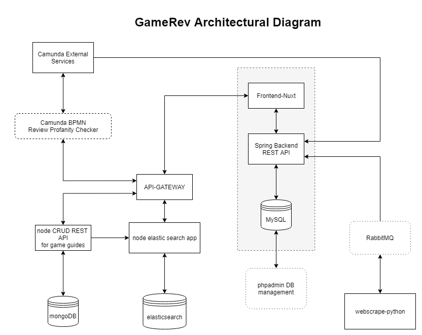

# Team 5 - #IkkeForLangt

- Andreas Guldborg Heick - cph-ah384@cphbusiness.dk
- Rasmus Jarnborg Friis - cph-rf43@cphbusiness.dk
- Mohammad Hariri - cph-mh682@cphbusiness.dk

<br>

# gameRev

gameRev is a game review platform, where people from all around the world can read and write reviews for their favorite games.



<br>

## Implementation & features

<br>

### Frontend

We have developed a client frontend using Vue.js combined with the Nuxt.js framework. The frontend uses Vue, Nuxt, HTML and CSS with bootstrap, to create a frontpage, that serves the client with several popular games.

A client can then click on a game, and see more details, including other people's reviews. The client can also write their own reviews, and give a rating between 1-5 stars.

Our frontend's only function is to display data served by our backend, but we have also used our frontend to fetch from the rawg.io API.

The API from rawg.io, only provides us with game data and nothing else.

<br>

### Backend

For the System Integration part, we have used a Java backend using Spring Boot. Spring Boot makes it easy to create stand-alone, production-grade Spring based Applications that you can "just run".

The backend is a REST API, that sends JSON as response.
Using Axios in the frontend, we can call on the backend, and use CRUD operations on the database, which is built in MySQL.

Our backend also communicates with a SOAP API that takes a country ISOCODE and returns that country's flag. We use this for our reviews, so reviewers and people reading reviews, can show and see which country the reviewer comes from.

So we have a frontend client, a backend that consumes SOAP requests and itself communicates using REST.

<br>

### SpringBoot Setup

Our Java backend uses PHPAdmin to communicate with the MySQL database, this tool can be used to view the database.

<br>

### BPMN

We are using BPMN to check for profanities in our reviews, before they are posted.

<br>

### Webscraping - RabbitMQ

We have used a python script to webscrape from SteamSpy, and retrieve game prices and how many units that the game has sold. We used RabbitMQ as the broker that takes care of the communication between our backend and our webscraper script.

[Further Webscraping Documentation](https://github.com/Hoppedyr/gameRev/tree/main/GameRev-Webscraping)
<br>

### Microservices

We have made a MongoDB CRUD application to make and save game guides, and we have made an Elastic Search Application that allows for implementing a search function that can search through game guides.

[Further Microservices Documentation](https://github.com/Hoppedyr/gameRev/tree/main/GameRev-Microservices)

<br>

## Build Setup

Everything we have made has been put in a Docker Container, which will run everything needed.

Frontend: [localhost:3000](http://localhost:3000)  
Backend API: [localhost:8080](http://localhost:8080)  
Backend PHPAdmin: [localhost:8082](http://localhost:8082)

- PHPAdmin (username: root, password: app)

<br>

REQUIREMENTS:

- DOCKER - (https://www.docker.com/get-started)

<br>

### STEP 1:

```bash
# To start the application, simply cd into the root of the project /gameRev
# and follow these instructions

$ docker-compose up -d
```

### STEP 2:

```bash
# now we need to start the API Client that connects the frontend to the microservices

$ cd GameRev-Microservices/

# run this command and leave the console running
$ npm install && npm start

```

### STEP 3:

Go to the root project folder and run
the file [indexing_and_webscrapingjob.bat](indexing_and_webscrapingjob.bat)

OR

```bash
# this command imports data and indexes it in Elastic Search
$ docker exec -it gamerev_elasticnode_1 node data.js

# this command starts our webscraping job, that runs every 10 min, so keep it running
$ python GameRev-Webscraping/GameRevWebscrape.py
```

<br>

If the frontend container fails because of nuxt, then this might be because of your Docker setup. Docker Desktop should fix the issue.
Otherwise you can also **npm install** yourself in the frontend folder.

## Monitoring & Logging

To view logs and monitor the dockerized applications use this command in root where the docker-compose.yml file is located:

```bash
$ docker-compose logs
```

If you want to monitor a single container use:

```bash
$ docker-compose logs container-name
```
